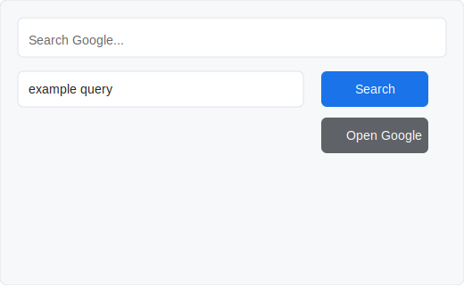

# Google Search (Opera) — Extension

This small Opera extension adds:

- a context menu item when text is selected: "Search Google for \"%s\""
- a popup to type a query or open Google quickly

Screenshots:

How to load in Opera:

1. Open Opera and navigate to `opera://extensions`.
2. Enable Developer mode (toggle in the top-right).
3. Click **Load unpacked** and select this folder: the `opera-extension` directory.

Icon preview:

Notes:

- This is a Chromium-style extension and should be compatible with Opera's extension system.
